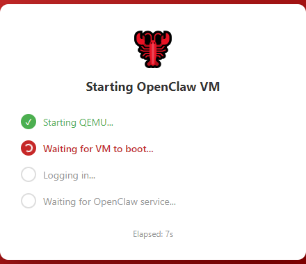

# QemuClaw

[](https://github.com/NewJerseyStyle/QemuClaw/actions/workflows/build.yml)
[](https://github.com/NewJerseyStyle/QemuClaw/actions/workflows/build-app.yml)

One-click isolated deployment for [OpenClaw](https://github.com/alpine/openclaw) — a personal AI assistant running securely inside a QEMU virtual machine.

> **Think of it as an aquaculture facility for your OpenClaw**: a contained environment that keeps your OpenClaw thriving without damaging your furniture (main system).
> With 1,000+ known vulnerabilities — including 4+ critical ones enabling potential remote code execution — isolation is essential.



## Download

### Desktop App

<!-- APP_DOWNLOAD:START -->
> First release coming soon. Run from source in the meantime (see Development section below).
<!-- APP_DOWNLOAD:END -->

### VM Image

<!-- VM_DOWNLOAD:START -->
[Download OpenClaw VM Image](https://github.com/NewJerseyStyle/QemuClaw/releases) — go to releases page and download the latest `vm-headless-*` release.
<!-- VM_DOWNLOAD:END -->

## Install (Desktop App)

**Windows:** Download and run the `.exe` installer. QEMU and 7-Zip are bundled — no extra setup.

**macOS:** Install QEMU first (`brew install qemu`), then open the `.dmg`.

**Linux:** Install QEMU first (`sudo apt install qemu-system-x86`), then run the `.AppImage` or install the `.deb`.

On first launch, the app will:
1. Ask you to locate QEMU if it's not bundled or found automatically
2. Show a setup wizard for VM resources (memory, CPU, shared folder)
3. Download the VM image if not already present
4. Boot the VM headless — a status window shows boot progress
5. Open the terminal for OpenClaw onboarding setup
6. After setup, access OpenClaw via the Web UI (system tray > Open Web UI)

The app runs in the system tray. Right-click the tray icon for all options.

|The icon in system tray|
|-----------------------|
|   |

## Manual Quick Start (without Desktop App)

If you prefer to run QEMU directly:

1. Install [QEMU](https://www.qemu.org/download/)
2. Download the VM image from the releases page (`.qcow2` file, or `.tar.gz.*` split files)
3. If split files: `cat *.tar.gz.* | tar xvfz -`
4. Start the VM:
   ```bash
   qemu-system-x86_64 -m 2G -smp 2 \
     -drive file=./openclaw-headless-compressed.qcow2,format=qcow2
   ```
5. Login with username `node` and password `openclaw`
6. Run `cd /app && node dist/index.js onboard`

## Development

```bash
git clone https://github.com/NewJerseyStyle/QemuClaw.git
cd QemuClaw
npm install
npm start
```

Requirements for development:
- Node.js 18+
- QEMU installed and on PATH (or set path in the app on first launch)
- 7-Zip installed (for VM image extraction on Windows)

## Using Local LLMs (Ollama, LM Studio, etc.)

If you run a local LLM provider on your host machine, the VM can access it via the hostname `host.local` (resolves to `10.0.2.2`, the QEMU user-mode networking gateway to the host).

| Host service | URL from inside the VM |
|---|---|
| Ollama (`localhost:11434`) | `http://host.local:11434` |
| LM Studio (`localhost:1234`) | `http://host.local:1234` |
| Any host service on port N | `http://host.local:N` |

During OpenClaw onboarding, when asked for an API endpoint, use `http://host.local:<port>` instead of `http://localhost:<port>`.

## Architecture

```
QemuClaw (Electron app)
  |
  |-- QEMU (headless, -display none)
  |     |-- Serial console (TCP) --> xterm.js terminal in app
  |     |-- QMP control (TCP)    --> graceful shutdown, status
  |     |-- Port forwarding      --> localhost:18789 (OpenClaw Web UI)
  |     \-- Shared folder        --> SMB (Windows) / 9p (Linux/macOS)
  |
  \-- System tray
        |-- Open Web UI
        |-- Open Terminal
        |-- Update OpenClaw
        |-- Restart VM
        |-- Settings
        \-- Quit
```

## License

MIT
